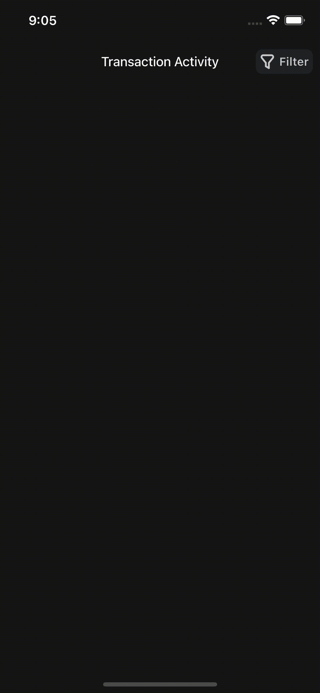

# Transaction Activity UI Demo

A flutter project demonstrating a transaction acitvity page also showing filters too for various available transaction status

## Structure

```
.
`-- kobi_test/
    |-- core/
    |   `-- utils/
    |       |-- colors.dart
    |       |-- currency_formatter.dart
    |       |-- hex_color.dart
    |       `-- theme.dart
    `-- lib/
        |-- core
        |-- src/
        |   |-- controller/
        |   |   `-- transaction_provider.dart
        |   |-- model/
        |   |   |-- enum/
        |   |   |   `-- status.dart
        |   |   `-- transaction_model.dart
        |   `-- view/
        |       |-- pages/
        |       |   `-- transaction_page.dart
        |       `-- widgets/
        |           |-- bottom_sheet_widget.dart
        |           `-- filter_widget.dart
        `-- main.dart
```

## State Management

Riverpod was used for state management for both filters & transactions provider

## Demonstration


